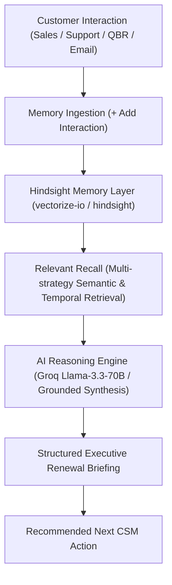

# RenewalOS — AI Customer Success Memory Agent

> **Tagline:** Remember Every Customer. Learn From Every Renewal.  
> **Built for the AI-Agent Hackathon:** *"AI Agents That Learn Using Hindsight"*

---

## 🌟 Overview

**RenewalOS** is an AI Customer Success Memory Agent built with **FastAPI**, **React**, **Tailwind CSS**, **Groq LLM**, and **Hindsight** (by Vectorize.io). Customer information is normally scattered across sales calls, emails, support tickets, and QBR meetings. RenewalOS retains these interactions in a persistent memory layer (**Hindsight**) to provide grounded context before meetings, track unresolved commitments, calculate true risk scores, and recognize historical churn patterns across accounts.

---

## 🚀 Key Features & Differentiators

1. **Memory Growth Demonstration (`REMEMBER → RECALL → LEARN → ACT`):**  
   Visually demonstrates how an AI agent becomes significantly more accurate and contextual as interaction memories accumulate ($0 \rightarrow 5 \rightarrow 12 \rightarrow 25+$ memories).
2. **Cross-Account Pattern Recognition:**  
   Compares an active customer's current memory signals against historical accounts that either *renewed* or *churned* to detect early risk warnings.
3. **Grounded AI Briefings ("Why am I seeing this?"):**  
   Every AI insight links back to the specific Hindsight interaction memories (sales call, QBR commitment, support ticket) that generated it.
4. **Interactive 3-Stage Hackathon Demo Mode (`/demo`):**  
   Designed for live presentations:
   - **Stage 1 (Cold Start):** 0 memories stored $\rightarrow$ generic response.
   - **Stage 2 (Customer Context):** 5 memories added $\rightarrow$ grounded account briefing.
   - **Stage 3 (Learned Patterns):** Cross-account historical recall enabled $\rightarrow$ risk pattern matching & intervention playbook.

---

## 🏗 Architecture



---

## 🛠 Tech Stack

- **Backend:** Python 3.13, FastAPI, Pydantic, Hindsight Client, Groq LLM API, Pytest
- **Frontend:** React 18, TypeScript, Vite, Tailwind CSS, Framer Motion, Lucide Icons, React Router v6
- **Memory Engine:** Hindsight Cloud / Local Hindsight Service API

---

## 📁 Repository Structure

```
Renewal OS/
├── backend/
│   ├── app/
│   │   ├── main.py              # FastAPI app & Health endpoints
│   │   ├── config.py            # Environment configuration
│   │   ├── api/                 # Endpoints (accounts, memories, copilot, demo)
│   │   ├── models/              # Pydantic schemas & Synthetic seed dataset
│   │   └── services/            # Hindsight memory service & Agent reasoning engine
│   ├── tests/                   # Pytest test suite
│   ├── requirements.txt
│   └── .env.example
├── frontend/
│   ├── src/
│   │   ├── components/          # MemoryTimeline, MemoryGrowthWidget, CopilotResponseCard, Modal
│   │   ├── pages/               # Dashboard, Accounts, AccountDetail, Copilot, Demo
│   │   ├── services/            # Axios API client
│   │   ├── types/               # TypeScript interfaces
│   │   ├── App.tsx
│   │   └── main.tsx
│   ├── package.json
│   └── tailwind.config.js
└── README.md
```

---

## ⚡ Quick Start & Setup

### 1. Backend Setup

```bash
cd backend
python3 -m venv venv
source venv/bin/activate
pip install -r requirements.txt
cp .env.example .env
# Optional: Set GROQ_API_KEY and HINDSIGHT_API_KEY in .env

# Run Pytest suite
PYTHONPATH=. pytest

# Start Backend Server (runs on http://localhost:8000)
uvicorn app.main:app --reload --port 8000
```

### 2. Frontend Setup

```bash
cd frontend
npm install --legacy-peer-deps
npm run build

# Start Frontend Dev Server (runs on http://localhost:5173)
npm run dev
```

---

## 🎬 3-Minute Hackathon Demo Flow

1. **0:00 - Overview:** Open Dashboard (`/`), highlight the metric cards and 3 high-attention accounts.
2. **0:30 - Acme Memory Timeline:** Navigate to `/accounts/acme-corp`. View chronological timeline of sales objections, SAML SSO support tickets, and QBR promises.
3. **1:00 - Interactive Hackathon Demo (`/demo`):**
   - Click **Reset 0 (Stage 1 Cold Start)** and query *"Prepare me for Acme's renewal"*. Note generic answer.
   - Click **Add 5 Customer Memories (Stage 2)**. Query again and see detailed, grounded briefing.
   - Click **Enable Cross-Account Learning (Stage 3)**. Query *"Is Acme showing a known churn pattern?"*. View pattern matching against *NorthStar Logistics* and *NovaHealth*.
4. **2:30 - Grounded Evidence:** Click **"Why am I seeing this?"** on any briefing card to display exact Hindsight memory citations.

---

## 🔗 Official Links & References

- **Hindsight Documentation:** [https://hindsight.vectorize.io/](https://hindsight.vectorize.io/)
- **Hindsight GitHub:** [https://github.com/vectorize-io/hindsight](https://github.com/vectorize-io/hindsight)
- **Groq AI:** [https://groq.com/](https://groq.com/)
